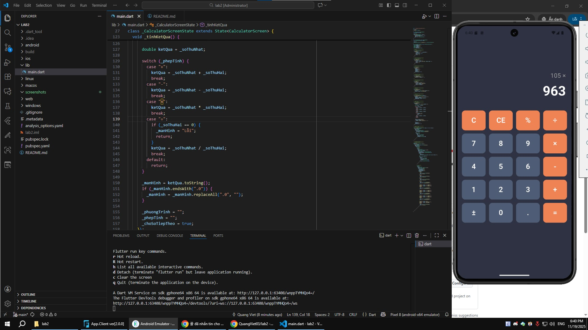
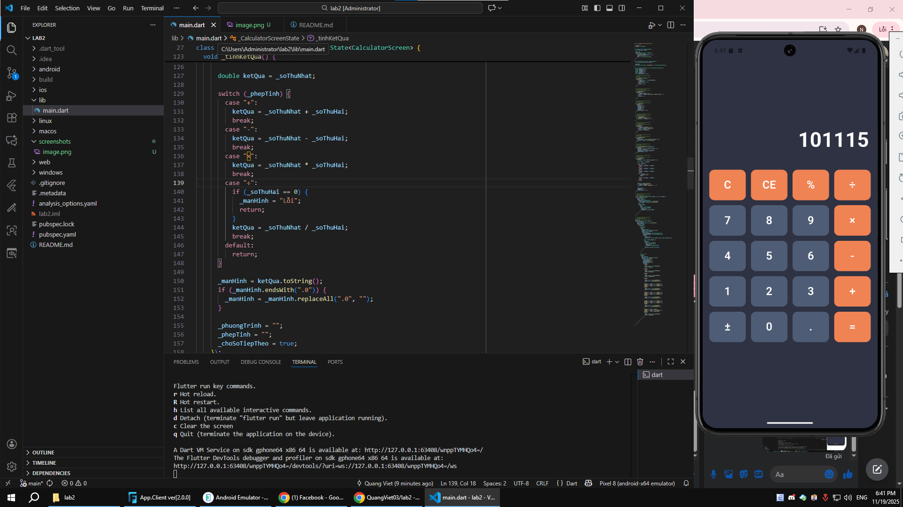

# Máy Tính Flutter (Flutter Calculator App)

Ứng dụng máy tính di động đơn giản được xây dựng bằng **Flutter**

Ứng dụng hỗ trợ các phép toán cơ bản, quản lý trạng thái, bố cục giao diện chuẩn Figma và xử lý lỗi người dùng.

---

## Phiên Bản Sử Dụng

- **Flutter:** 3.38.2  
- **Dart:** 3.10.0 
---

## Tính Năng Chính

### Các Phép Tính Cơ Bản
- Cộng (+)
- Trừ (−)
- Nhân (×)
- Chia (÷)
- Thập phân (.)
- Phần trăm (%)

### Chức Năng Hỗ Trợ
- Xóa tất cả: **C**
- Xóa ký tự cuối: **CE**
- Đổi dấu âm/dương (**±**)
- Xử lý lỗi chia cho 0 (hiển thị “Error”)
- Hiển thị phương trình + kết quả rõ ràng

### Giao Diện
- Màu theo Figma:
  - **Primary:** #2D3142  
  - **Secondary:** #4F5D75  
  - **Accent:** #EF8354  
- Border radius 12px
- Padding chuẩn 16–20px
- UI hiển thị rõ ràng, nút bấm đều, dễ thao tác

---

## Screenshots

Dán ảnh vào thư mục:  

